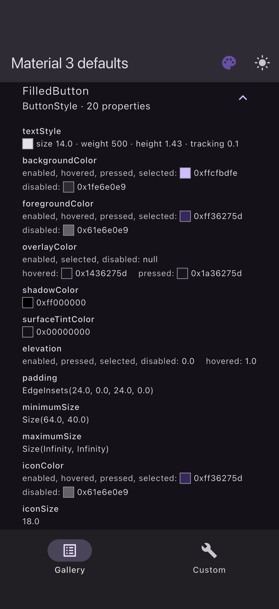
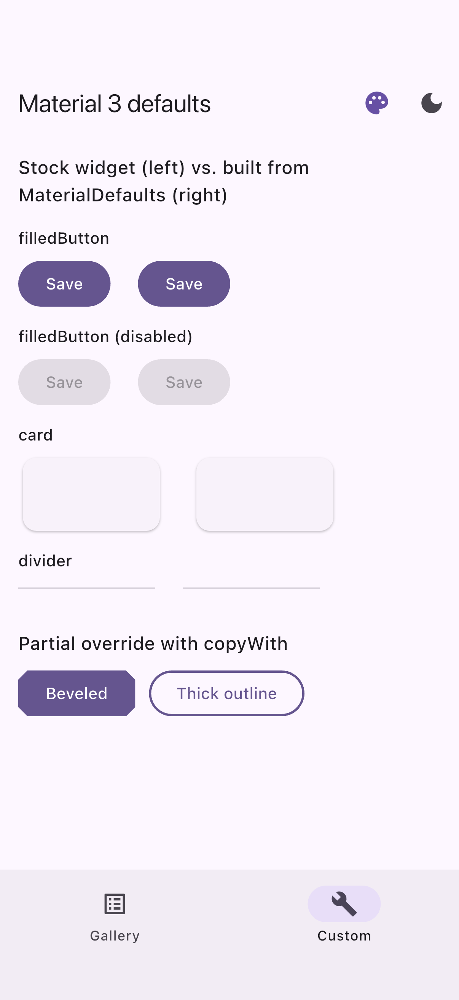

# material_defaults

Public, context-aware access to the **Material 3 default styles** that
Flutter widgets compute in private classes such as `_FilledButtonDefaultsM3`
and `_InputDecoratorDefaultsM3`.

Solves [flutter/flutter#130135](https://github.com/flutter/flutter/issues/130135)
("Expose M3 defaults", labelled *would be a good package*).

<p>
  
  
</p>

*Example app on the iOS simulator: the defaults gallery, and stock widgets
next to re-implementations built only from `MaterialDefaults` (verified
pixel-identical by the example's integration test).*

## Why

Flutter generates each Material 3 component's defaults from the Material
Design token database (`dev/tools/gen_defaults`), but keeps the resulting
classes private. So you cannot read "what color is a disabled `FilledButton`"
to build a custom widget that matches Material, or change one property of a
theme while keeping every other default.

`material_defaults` gives you those objects:

```dart
final defaults = MaterialDefaults.of(context);

final ButtonStyle filled = defaults.filledButton;
final Color? disabledBg =
    filled.backgroundColor?.resolve(<WidgetState>{WidgetState.disabled});

// Partial override: change only the shape, keep every state-dependent default.
FilledButton(
  style: defaults.filledButton.copyWith(
    shape: const WidgetStatePropertyAll(RoundedRectangleBorder()),
  ),
  onPressed: () {},
  child: const Text('Square'),
);
```

## How the values are made exact

* `tool/generate.dart` runs **the SDK's own `gen_defaults` templates** over
  the SDK's token JSON (`dev/tools/gen_defaults/data`) and fails unless every
  generated block is byte-identical to the block compiled into
  `packages/flutter/lib/src/material`. The output is committed in
  `lib/src/generated/` (47 blocks from 39 framework files).
* `MaterialDefaults.tokenVersion` records the Flutter version the tokens came
  from (`3.41.8`), with `flutterRevision` and `tokenDataVersions` (`6_1_0`).
* 214 tests prove equivalence with what the real widgets use, in a light and
  a dark `ColorScheme`:
  * **instance parity** – where the framework exposes its private object
    (`ButtonStyleButton.defaultStyleOf`, `MenuItemButton.defaultStyleOf`,
    `RawChip.defaultProperties`, `DatePickerTheme.defaults`) every property is
    compared, resolving each `WidgetStateProperty` for all 256 combinations of
    8 widget states;
  * **render parity** – for every other component the real widget is pumped
    with the stock theme and with our defaults injected as the component
    theme, through idle / hover / keyboard-focus / press (or open) states;
    pixels and render trees must be identical, and a perturbed copy must
    render differently;
  * **source parity** – the generated code equals the running framework's.

## Install

```sh
flutter pub add material_defaults
```

or add it to `pubspec.yaml` yourself:

```yaml
dependencies:
  material_defaults: ^0.1.0
```

## Usage

Call `MaterialDefaults.of(context)` inside `build`. Values resolve against
the nearest `Theme` (its `ColorScheme` and `TextTheme`).

```dart
import 'package:material_defaults/material_defaults.dart';

@override
Widget build(BuildContext context) {
  final defaults = MaterialDefaults.of(context);

  // 1. Read a single default for a given state.
  final Color? hoverOverlay = defaults.filledButton.overlayColor
      ?.resolve(<WidgetState>{WidgetState.hovered});

  // 2. Build a custom widget that matches Material exactly.
  final CardThemeData card = defaults.outlinedCard;
  return Material(
    color: card.color,
    shape: card.shape,
    elevation: card.elevation ?? 0,
    child: const Padding(padding: EdgeInsets.all(16), child: Text('Custom')),
  );
}
```

Override one property of a component theme while keeping every other default:

```dart
Builder(
  builder: (context) {
    final defaults = MaterialDefaults.of(context);
    return Theme(
      data: Theme.of(context).copyWith(
        filledButtonTheme: FilledButtonThemeData(
          style: defaults.filledButton.copyWith(
            shape: const WidgetStatePropertyAll(StadiumBorder()),
          ),
        ),
      ),
      child: child,
    );
  },
);
```

`MaterialDefaults.tokenVersion` tells you which Flutter version the values
were generated from. See `example/` for a full gallery.

## What is exposed

| Group | Members |
|-------|---------|
| Buttons | `elevatedButton`, `filledButton`, `filledTonalButton`, `outlinedButton`, `textButton`, `iconButton()`, `filledIconButton()`, `filledTonalIconButton()`, `outlinedIconButton()` (each with `toggleable`), `menuButton`, `segmentedButton` |
| FAB | `floatingActionButton`, `smallFloatingActionButton`, `largeFloatingActionButton`, `extendedFloatingActionButton({hasIcon})` |
| Surfaces | `card`, `filledCard`, `outlinedCard`, `dialog`, `fullscreenDialog`, `bottomSheet`, `snackBar({floating})`, `banner`, `divider`, `listTile`, `expansionTile` |
| Chips | `chip({enabled})`, `actionChip({enabled, elevated})`, `filterChip({enabled, selected, elevated})`, `choiceChip(...)`, `inputChip({enabled, selected})` |
| Inputs | `inputDecoration`, `checkbox`, `radio`, `switchTheme`, `slider`, `rangeSlider`, `searchBar`, `searchView({fullScreen})`, `datePicker` |
| Navigation | `appBar`, `bottomAppBar`, `navigationBar`, `navigationRail`, `navigationDrawer`, `drawer`, `tabBar({isScrollable})`, `secondaryTabBar({isScrollable})`, `menu`, `menuBar`, `popupMenu` |
| Feedback | `badge`, `linearProgressIndicator`, `circularProgressIndicator({indeterminate})` |

Every member returns an ordinary framework object (`ButtonStyle`,
`ChipThemeData`, `InputDecorationThemeData`, …): `resolve`, `copyWith`,
`merge` and passing it to `ThemeData` all work. Values are snapshots taken
when you call the member, so obtain them in `build`.

## Platform support

Pure Dart/Flutter, no platform code.

| Android | iOS | Web | macOS | Windows | Linux |
|:-------:|:---:|:---:|:-----:|:-------:|:-----:|
| ✅ | ✅ | ✅ | ✅ | ✅ | ✅ |

## Limitations

* **Version-specific.** Values are exact for Flutter `tokenVersion`
  (3.41.8). The package requires `flutter >=3.41.0`; on a newer framework
  whose defaults changed, regenerate with
  `dart run tool/generate.dart --flutter-root <sdk>` (the `source_parity`
  test fails when the committed code no longer matches the running SDK).
* **Material 3 only.** With `useMaterial3: false` widgets use other classes;
  check `appliesToCurrentTheme`.
* **Not everything is token generated.** `Tooltip`, `DropdownMenu`,
  `TimePicker` (extends a private base class), medium/large `SliverAppBar`
  title configs and the `year2023: true` Slider / progress indicators are
  hand-written in the framework and are not exposed. `slider`, `rangeSlider`
  and the progress indicator members are the `year2023: false` defaults.
* **Effective values over private values.** Where a private class declares a
  value its widget never reads, the member returns what the widget renders:
  `appBar` (toolbarHeight 56, scrolled-under `surfaceContainer`, `surfaceTint`
  tint), `banner.elevation` 0, fixed `snackBar()` without shape.
  `dialog` matches `Dialog`/`AlertDialog`; `SimpleDialog` titles use
  `titleLarge`.
* **Setting a theme property can differ from leaving it unset** in a few
  widgets that branch on *presence*, not value: `RawChip` disables its
  InkWell hover color once `chipTheme.color` is set; `SnackBar` switches its
  hit-test behavior when `snackBarTheme.insetPadding` is set; `TabBar` adds
  `WidgetState.selected` for the selected tab only when resolving its own
  defaults. Reading and resolving the values is unaffected.

## Example app

`example/` has a gallery of every member (states grouped by resolved value,
colors as swatches), a light/dark and seed switcher, and a *Custom* tab where
a button, card and divider re-implemented from `MaterialDefaults` sit next to
the stock widgets. `example/integration_test/app_test.dart` runs the real app,
walks the whole gallery in light and dark, captures screenshots and asserts
the custom widgets are pixel-identical to the stock ones:

```sh
cd example
flutter test integration_test -d <device> --dart-define=SHOT_DIR=/tmp/shots
```

## Regenerating

```sh
dart run tool/generate.dart            # uses FLUTTER_ROOT or `flutter` on PATH
dart run tool/generate.dart --check    # exit 1 if lib/src/generated is stale
```

## License

MIT © 2026 Manish Kumar Panday. Generated/copied framework code is
© The Flutter Authors, BSD-3-Clause (see `LICENSE`).
